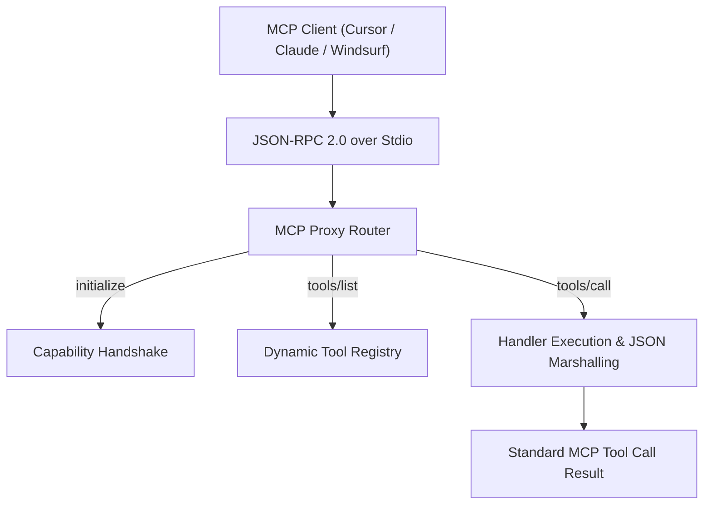

# genpark-mcp-protocol-proxy-router-skill

Agent Skill implementing a **Model Context Protocol (MCP) JSON-RPC 2.0 Proxy Router** in 100% Python standard library.

## Architectural Flow

```mermaid
flowchart TD
    Client["MCP Client (Cursor / Claude / Windsurf)"] --> Stdio["JSON-RPC 2.0 over Stdio"]
    Stdio --> Router["MCP Proxy Router"]
    Router -->|initialize| Caps["Capability Handshake"]
    Router -->|tools/list| Catalog["Dynamic Tool Registry"]
    Router -->|tools/call| Exec["Handler Execution & JSON Marshalling"]
    Exec --> Response["Standard MCP Tool Call Result"]
```
